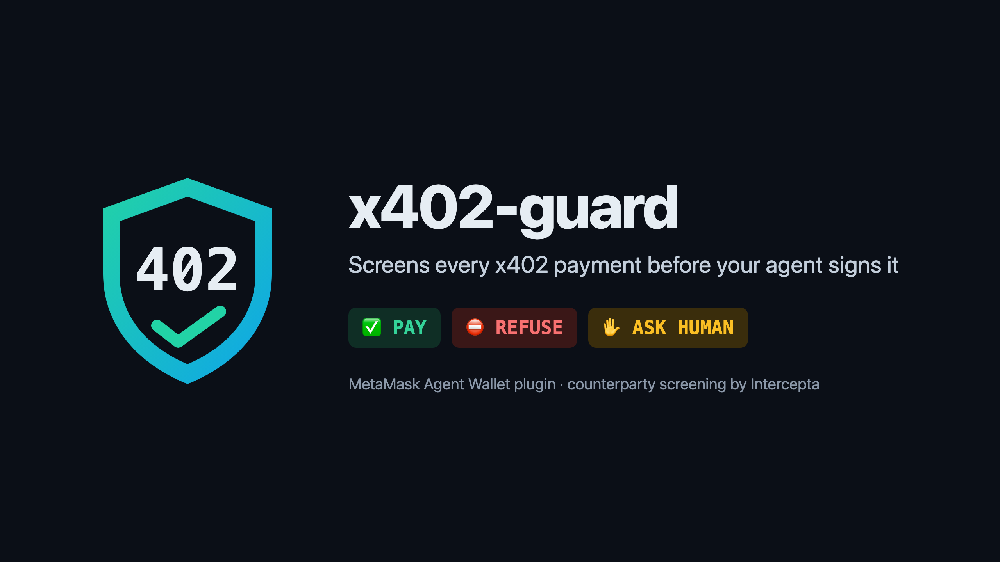
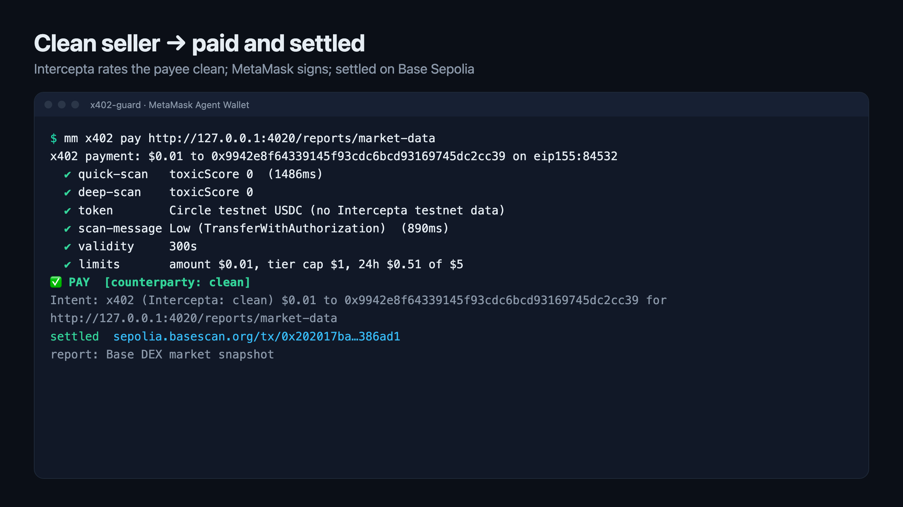
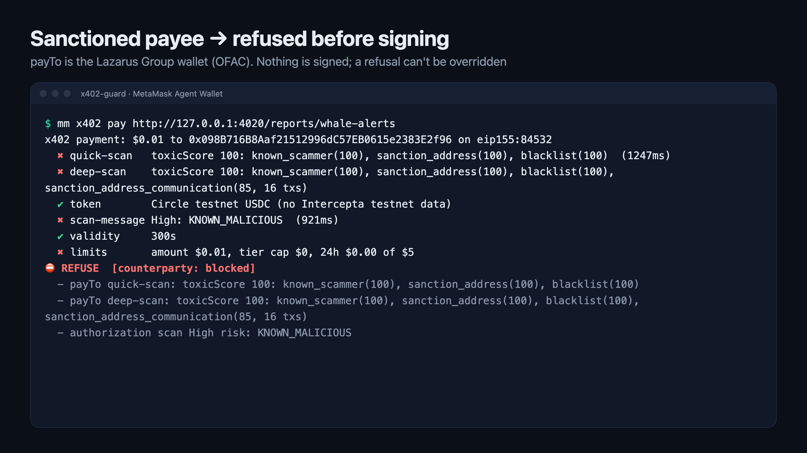
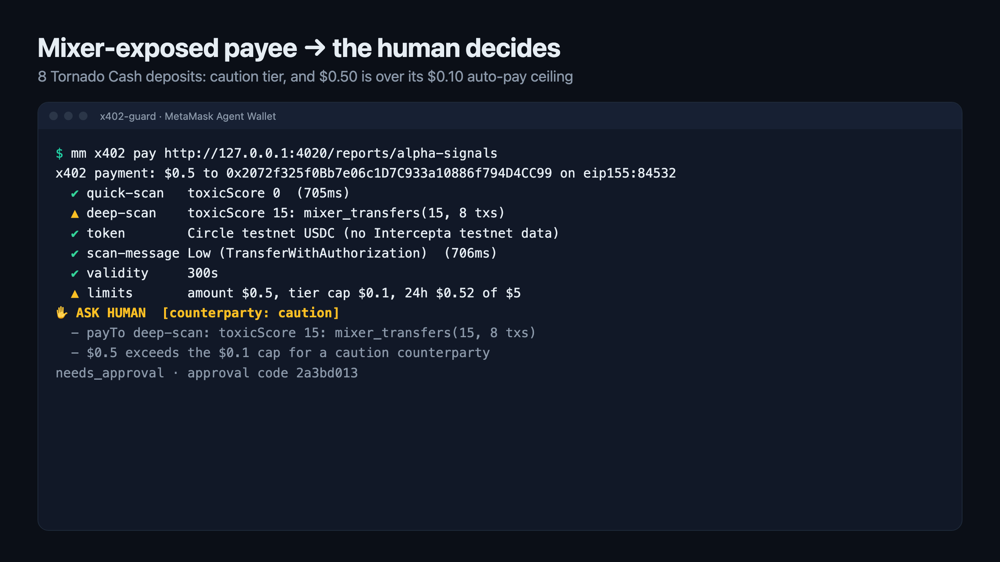

# x402-guard: Intercepta screening for MetaMask Agent Wallet x402 payments



**MetaMask stops your agent from getting robbed. x402-guard stops it from paying the wrong people.**

x402-guard is a [MetaMask Agent Wallet](https://docs.metamask.io/agent-wallet/) plugin. It screens every x402 payment
with the [Intercepta](https://intercepta.io) API **before the wallet signs it**, shows the verdict with its reasons,
and lets that verdict decide what happens: **pay**, **cap**, **ask a human**, or **refuse**.

## The gap we found

x402 payments are EIP-3009 `TransferWithAuthorization` **signatures**, not transactions. MetaMask's own x402 helper
signs them with `mm wallet sign-typed-data`. Its docs say signatures don't count toward the outflow limit, and
Blockaid threat scanning is described for transactions.

We tested it against a real server wallet in **Guard Mode**, funded with 2.5 USDC on Base ([`gap-test/`](gap-test)).
The wallet signed every one of these, with no 2FA prompt:

| x402 payment                                           | Signed? | Would it settle on Base?                 |
| ------------------------------------------------------ | ------- | ---------------------------------------- |
| 2.4 USDC (96% of the balance) to the Tornado Cash router | yes     | **yes**                                  |
| 0.01 USDC to the OFAC-sanctioned Lazarus wallet        | yes     | no, Circle has frozen it in USDC         |
| a lookalike "USD Coin" one hex digit off real USDC     | yes     | n/a                                      |
| an authorization valid for 1 year                      | yes     | not simulated (wallet was unfunded then) |

Circle already freezes sanctions-listed addresses in USDC. MetaMask's scanning is built to catch threats *to the
signer* (drainers, phishing). **Nobody checks who the agent is paying.** x402-guard adds that check.

## How it decides

| Check         | Intercepta endpoint | Outcome                                                                    |
| ------------- | ------------------- | -------------------------------------------------------------------------- |
| payTo         | Quick Scan Address  | sanctioned / known scammer / blacklist → **refuse**                        |
| payTo         | Deep Scan Address   | mixer, sanctioned-counterparty or scam exposure → **caution** tier         |
| token         | Scan Token          | not a verified token (lookalike USDC) → **refuse**                         |
| authorization | Scan Message        | the exact EIP-712 payload we're about to sign: High → **refuse**, Medium → caution |
| limits        | local               | above the tier ceiling or the 24h cap → **ask a human**; validity clamped to 10 min |

- A `clean` counterparty is auto-paid up to $1 and a `caution` counterparty up to $0.10. A `blocked` counterparty is
  never paid, and a refusal can't be overridden.
- "Ask a human" returns an approval code bound to the exact payee, token, amount and network. If the seller changes
  any of them, the approval is void.
- Signing still goes through MetaMask's own policy pipeline, so this adds to Guard Mode rather than replacing it.
- `mm x402 screen <address>` gives a counterparty risk profile on its own: tier, reasons, and how much to trust it.

## Demo

An agent buys three reports. Payments run on Base Sepolia; every payee is a real mainnet address screened with
Intercepta's mainnet data. All three are real `mm x402 pay` runs.

**Clean seller: paid and settled**
([`0x202017…6ad1`](https://sepolia.basescan.org/tx/0x202017ba16edef8466bb1276bc82fc4ac1d96ea4a6b51938b76409391c386ad1))



**Sanctioned payee (Lazarus Group): refused before anything is signed**



**Payee with 8 Tornado Cash deposits, $0.50 over its $0.10 caution ceiling: the human decides**



## Where the Intercepta API is called

- [`plugin/src/lib/intercepta.ts`](plugin/src/lib/intercepta.ts): the API client (Quick Scan, Deep Scan, Scan
  Token, Scan Message).
- [`plugin/src/lib/guard.ts`](plugin/src/lib/guard.ts): `screenAddress` and `screenPayment` call it and turn the
  results into the verdict.
- [`plugin/src/lib/flow.ts`](plugin/src/lib/flow.ts): `runX402` screens the authorization **before**
  `walletExecutor` signs it, and acts on the decision.

## Run it

```bash
npm i -g @metamask/agent-wallet && mm login && mm init --mode guard
cd plugin && npm install && npm run build && ./scripts-link-host.sh
mm config set experimentalPlugins true && mm config set experimentalAllowUnverifiedInstalls true
mm plugins install "file:$PWD" --accept-permissions && cd ..
echo 'INTERCEPTA_API_KEY=…' > .env
./demo/demo.sh     # one payment settles on Base Sepolia, one is refused, one is held for a human
```

The demo seller ([`demo/seller.py`](demo/seller.py)) serves x402 v2 challenges whose payees are real **mainnet**
addresses, screened with Intercepta's mainnet data. Payments run on **Base Sepolia**, and the one that passes is
verified and settled on-chain through the public x402 facilitator (`--settle`). Example settlement:
[`0x2116bb…cc07`](https://sepolia.basescan.org/tx/0x2116bbadfd09dee1b3ad41d7f17862aaae8d17f35d83a23aafd93221def5cc07)
(0.01 USDC, agent wallet → seller). Without `--settle` (and always on mainnet) the seller keeps the signature
and never settles. For agents, install
[`plugin/skills/x402-guard/SKILL.md`](plugin/skills/x402-guard/SKILL.md) so they pay through `mm x402 pay`.

## Limits we're honest about

- A plugin can add commands but can't intercept `mm wallet sign-typed-data`. The skill routes the agent through
  the guard. Enforcement you can't bypass belongs in MetaMask's server-side policy, and this plugin is a working
  reference for that check.
- Intercepta's address scans don't cover contracts, so a contract payTo (like the Tornado router) is screened by
  Scan Message and the caution ceiling only.
- Intercepta has no testnet data. Testnet payments are screened against the mainnet sibling chain, and Circle's
  testnet USDC is recognised by address.

## Intercepta API feedback

- **Time to first call:** about 10 minutes. The first request got a Cloudflare 403 (error 1010) because Python's
  default `User-Agent` is blocked. Any custom UA works, but the docs don't mention it.
- **Most confusing:** the Scan Message docs say `message` is a JSON *string*. Sent that way, it is silently not
  parsed and comes back `riskGroup: "Low"`, which fails open. Sent as an object, it works and even recognises x402's
  `TransferWithAuthorization`, which isn't in the documented `messageType` enum.
- **Missing:** address scans for contracts (they 404 "not an EOA"), and a chain parameter on address scans.
  Mixer exposure only shows up in the deep scan and scores low (0.4 to 15), so a policy has to read traits, not just
  `toxicScore`.
- **Latency:** quick scan 0.4 to 2 s. Deep scan 1 to 5 s warm, but 34 s on one cold address, which is too slow
  inline without caching. Scan Token on a non-contract "lookalike" returns `riskScore 0` and `action: info`. The
  real signal is `trust: whitelist` vs `neutral`.

## Layout

```
plugin/      the MetaMask Agent Wallet plugin (TypeScript): mm x402 pay | inspect | screen | config
demo/        demo.sh (pay / refuse / ask a human) and seller.py, the local x402 test seller
gap-test/    evidence: the test that showed Guard Mode signs unscreened x402 payments
```
